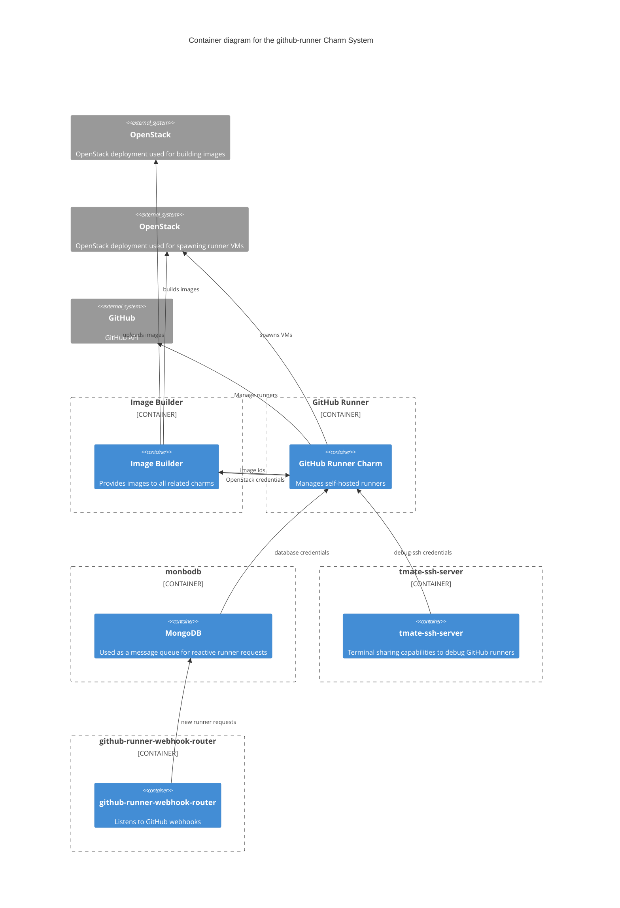

# GitHub runner
[](https://charmhub.io/github-runner)
[](https://github.com/canonical/github-runner-operator/actions/workflows/promote_charm.yaml)
[](https://discourse.charmhub.io)

**Important** Use the [local-lxd](https://charmhub.io/github-runner?channel=local-lxd/stable) track for LXD runners.

This machine charm creates self-hosted runners for running GitHub Actions. Each unit of this charm will start a configurable number of OpenStack based virtual machines to host them. Every runner performs only one job, after which it unregisters from GitHub to ensure that each job runs in a clean environment.

The charm will periodically check the number of runners and spawn or destroy runners as necessary to match the number provided by configuration of runners. Both the reconciliation interval and the number of runners to maintain are configurable.

Like any Juju charm, this charm supports one-line deployment, configuration, integration, scaling, and more. For GitHub runner, this includes:
* Scaling the number of runners up or down
* Configuration for the resources of virtual machines
* Configuration for the reconciliation interval to check/adjust the number of runners
* [COS integration](https://charmhub.io/topics/canonical-identity-platform/how-to/integrate-cos)

For information about how to deploy, integrate, and manage this charm, see the official [GitHub Runner Documentation](https://charmhub.io/github-runner).

## Get started

For information about a production deployment, the how-to-guide
[How to spawn OpenStack runner](https://charmhub.io/github-runner/docs/how-to-openstack-runner) can be useful.

### Basic operations
A usual deployment of the charm can be done with the following command (please replace items in `<>` with your own values):

```bash
juju deploy github-runner --channel=latest/stable --config openstack-clouds-yaml="$(cat clouds.yaml)" --config openstack-flavor=<flavor> --config openstack-network=<openstack-network> --config path=<org>/<repo> --config token=<github-token>
```

with a cloud configuration (for the OpenStack tenant used to spawn runner VM's) in `clouds.yaml`:

```yaml
clouds:
  <cloud-name>:
    auth:
      auth_url: <keystone-auth-url>
      project_name: <project>
      username: <username>
      password: <password>
      user_domain_name: <user-domain-name>
      project_domain_name: <project-domain-name>
    region_name: <region>
  ```

Assuming you have already deployed the [Github Runner Image Builder](https://charmhub.io/github-runner-image-builder) charm
with the name `github-runner-image-builder`, you can use the following command to integrate it with the GitHub Runner charm:

```bash
juju integrate github-runner-image-builder github-runner
```

You can scale the amount of virtual machines using

```bash
juju config github-runner virtual-machines=5
```

You can change the reconciliation interval, to e.g. 5 minutes, using

```bash
juju config github-runner reconciliation-interval=5
```

You can trigger reconciliation manually using an action (assuming the unit is named `github-runner/0`):

```bash
juju run github-runner/0 reconcile-runners
```

If you need to flush and replace the runners with a new set of runners, you can use the following command:

```bash
juju run github-runner/0 flush-runners
```

## Overview of the GitHub runner ecosystem

The `github-runner` charm integrates with several other charms that work
together to facilitate the deployment, management and debugging of
self-hosted GitHub runners. Below is a high-level overview of the key
charms and their interactions:

* [GitHub Runner](https://charmhub.io/github-runner-image): The central component that manages self-hosted GitHub runners. It interacts with OpenStack to spawn runner VMs and communicates with GitHub to register and manage runners.
* [Image Builder](https://charmhub.io/github-runner-image-builder): Responsible for generating images. It builds images on the builder OpenStack project and uploads them to the GitHub Runner OpenStack project.
* [MongoDB](https://charmhub.io/mongodb): Acts as a message queue to handle reactive runner requests. The [github-runner-webhook-router](https://charmhub.io/github-runner-webhook-router) charm will put events in MongoDB that will be consumed by the github-runner charm. Only for reactive runners.
* [tmate-ssh-server](https://charmhub.io/tmate-ssh-server): Provides terminal-sharing capabilities to enable debugging of GitHub runners. Optional.
* [COS lite stack](https://charmhub.io/topics/canonical-observability-stack/editions/lite): Provides observability to the Github runners ecosystem. Optional.

Below is a diagram representing these components and their relationships, excluding the [COS lite stack](https://charmhub.io/topics/canonical-observability-stack/editions/lite):




## Integrations
The charm supports [multiple integrations](https://charmhub.io/github-runner/integrations),
but in order to deploy the charm using OpenStack VM's for the runners, you need it to relate it
with an image-builder using the [image](https://charmhub.io/github-runner/integrations#image) 
endpoint. Via this integration, the charm detects the supported images to use for spawning the virtual machines.


## Repository structure

This repository contains the charm in the root directory and the Python package `github-runner-manager` in the
`github-runner-manager` directory. Refer to [Contributing](CONTRIBUTING.md) for more information.


## Learn more
* [Read more](https://charmhub.io/github-runner)
* [Developer documentation](https://charmhub.io/github-runner/docs/how-to-contribute)

## Project and community
* [Issues](https://github.com/canonical/github-runner-operator/issues)
* [Contributing](https://charmhub.io/github-runner/docs/how-to-contribute)
* [Matrix](https://matrix.to/#/#charmhub-charmdev:ubuntu.com)
