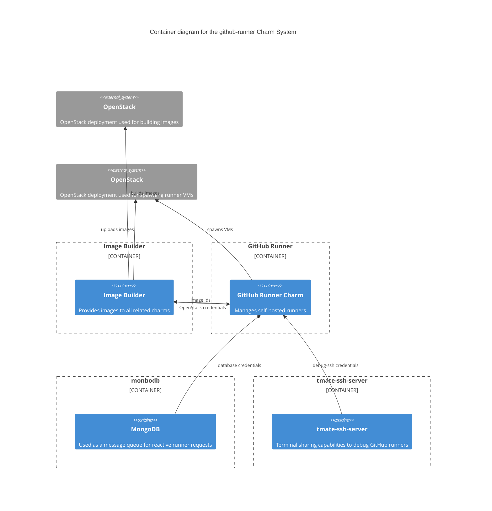
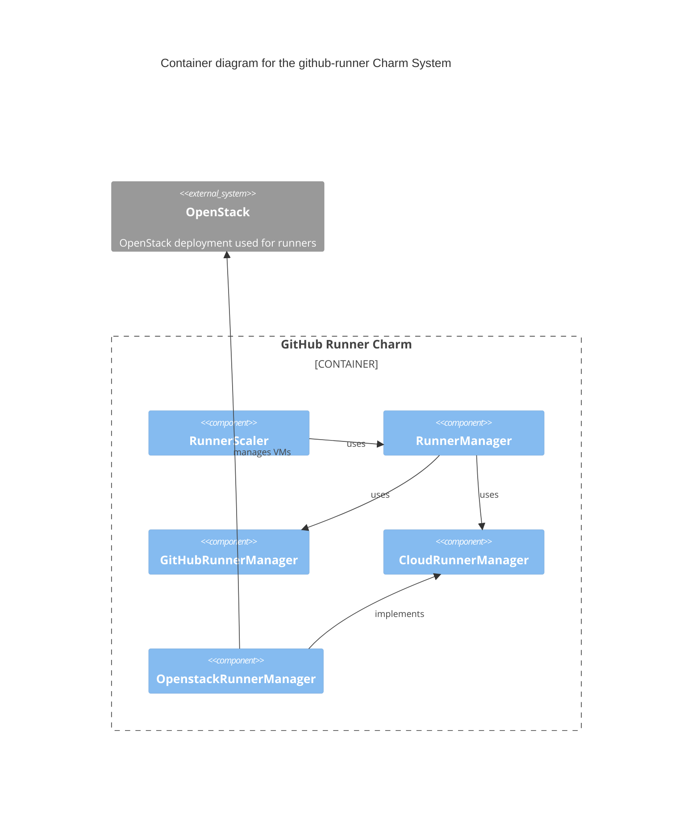

# Charm architecture

A [Juju](https://juju.is/) [charm](https://juju.is/docs/olm/charmed-operators) to operate a set of [GitHub self-hosted runners](https://docs.github.com/en/actions/hosting-your-own-runners/managing-self-hosted-runners/about-self-hosted-runners) while managing security and resource usage.

Conceptually, the charm can be divided into the following:

- Management of OpenStack virtual machines to host self-hosted runners
- Management of the virtual machine image
- Management of the network
- GitHub API usage
- Management of [Python web service for checking GitHub repository settings](https://github.com/canonical/repo-policy-compliance)
- Management of dependencies

## Virtual machines

To ensure a clean and isolated environment for every runner, self-hosted runners use OpenStack virtual machines. The charm spawns virtual machines, setting resources based on charm configurations. Virtual machines will not be reused between jobs, this is [similar to how GitHub hosts their runners due to security concerns](https://docs.github.com/en/actions/hosting-your-own-runners/managing-self-hosted-runners/about-self-hosted-runners#self-hosted-runner-security).

As the virtual machines are single-use, the charm will replenish virtual machines on a regular schedule. This time period is determined by the [`reconcile-interval` configuration](https://charmhub.io/github-runner/configure#reconcile-interval).

On schedule or upon configuration change, the charm performs a reconcile to ensure the number of runners managed by the charm matches the [`virtual-machines` configuration](https://charmhub.io/github-runner/configure#virtual-machines), and the resources used by the runners match the various resource configurations.

## Virtual machine image

The virtual machine images are built on installation and on a schedule using the [github-runner-image-builder](https://github.com/canonical/github-runner-image-builder).

## Network configuration

The charm respects the HTTP(S) proxy configuration of the model configuration of Juju. The configuration can be set with [`juju model-config`](https://juju.is/docs/juju/juju-model-config) using the following keys: `juju-http-proxy`, `juju-https-proxy`, `juju-no-proxy`. 
The GitHub self-hosted runner applications will be configured to utilise the proxy configuration. 
This involves setting environment variables such as `http_proxy`, `https_proxy`, `no_proxy`, `HTTP_PROXY`, `HTTPS_PROXY`, and `NO_PROXY`
in various locations within the runner environment, such as `/etc/environment`.

However, employing this approach with environment variables has its drawbacks. 
Not all applications within a workflow may adhere to these variables as they 
[lack standardisation](https://about.gitlab.com/blog/2021/01/27/we-need-to-talk-no-proxy/). 
This inconsistency can result in failed workflows, prompting the introduction of aproxy, as detailed in the subsection below.

### aproxy
If the proxy configuration is utilised and [aproxy](https://github.com/canonical/aproxy) is specified through the charm's configuration option,
all HTTP(S) requests to standard ports (80, 443) within the GitHub workflow will be automatically directed 
to the specified HTTP(s) proxy. Network traffic destined for ports 80 and 443 is redirected to aproxy using iptables.
aproxy then forwards received packets to the designated HTTP(S) proxy. 
Beyond that, the environment variables (`http_proxy`, `https_proxy`, `no_proxy`, `HTTP_PROXY`, `HTTPS_PROXY`, `NO_PROXY`)
will no longer be defined  in the runner environment. 
It's worth noting that this setup deviates from the behaviour when not using aproxy, 
where these variables are set in the runner environment. In that scenario, traffic to non-standard ports 
would also be directed to the HTTP(s) proxy, unlike when using aproxy.

## GitHub API usage

The charm requires a GitHub personal access token for the [`token` configuration](https://charmhub.io/github-runner/configure#token). This token is used for:

- Requesting self-hosted runner registration tokens
- Requesting self-hosted runner removal tokens
- Requesting a list of runner applications
- Requesting a list of self-hosted runners configured in an organization or repository
- Deleting self-hosted runners

The token is also passed to [repo-policy-compliance](https://github.com/canonical/repo-policy-compliance) to access GitHub API for the service.

Note that the GitHub API uses a [rate-limiting mechanism](https://docs.github.com/en/rest/using-the-rest-api/rate-limits-for-the-rest-api?apiVersion=2022-11-28). When this is reached, the charm may not be able to perform the necessary operations and may go into
BlockedStatus. The charm will automatically recover from this state once the rate limit is reset, but using a different token with a higher rate limit may be a better solution depending on your deployment requirements.

## GitHub repository setting check

The [repo-policy-compliance](https://github.com/canonical/repo-policy-compliance) is a [Flask application](https://flask.palletsprojects.com/) hosted on [Gunicorn](https://gunicorn.org/) that provides a RESTful HTTP API to check the settings of GitHub repositories. This ensures the GitHub repository settings do not allow the execution of code not reviewed by maintainers on the self-hosted runners.

Using the [pre-job script](https://docs.github.com/en/actions/hosting-your-own-runners/managing-self-hosted-runners/running-scripts-before-or-after-a-job#about-pre--and-post-job-scripts), the self-hosted runners call the Python web service to check if the GitHub repository settings for the job are compliant. If not compliant, it will output an error message and force stop the runner to prevent code from being executed.

## COS Integration
Upon integration through the `cos-agent`, the charm initiates the logging of specific metric events
into the file `/var/log/github-runner-metrics.log`. For comprehensive details, please refer to the
pertinent [specification](https://discourse.charmhub.io/t/specification-isd075-github-runner-cos-integration/12084).

Subsequently, the `grafana-agent` transmits this log file to Loki, facilitating access for Grafana's visualisation capabilities.
Notably, most events are transmitted during reconciliation. This approach prioritises long-term monitoring over real-time updates, aligning with the intended monitoring objectives.
